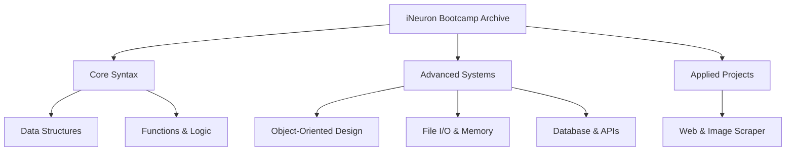

# Applied Python: iNeuron Bootcamp Architecture

[]()
[]()
[]()

## Overview
This repository functions as a comprehensive, applied Python reference index, constructed during the intensive iNeuron engineering bootcamp. It bridges the gap between theoretical syntax and applied systems engineering by encompassing native data structures, Object-Oriented patterns, OS-level file I/O management, and external API integrations.

## Problem Statement
Many engineers understand basic Python syntax but fail when architecting complex, stateful applications that require database connections, robust exception handling, or web scraping. This repository serves as a localized blueprint to solve those execution gaps, providing verified scripts demonstrating how to correctly handle memory management and connect to external data streams without causing application panics.

## Key Features
- **Data Structures:** Exhaustive implementations of native lists, dictionaries, tuples, and sets mapped to their respective time-complexities.
- **Object-Oriented Programming (OOP):** Deep architectural patterns demonstrating inheritance, encapsulation, and polymorphism.
- **Systems Engineering (OS/File I/O):** Safe data persistence protocols utilizing Python's `open()` context managers to prevent memory leaks.
- **External Integrations:** Functional blueprints for connecting raw Python scripts to SQL databases and REST APIs.
- **Web Scraping Application:** A complete end-to-end applied project (`web_and_image_scrapper`) demonstrating HTML DOM parsing via BeautifulSoup/Selenium.

## Architecture



## Technology Stack
- **Language:** Python 3.11
- **Testing:** `pytest` (Abstract Syntax Tree Validation)
- **Documentation:** GitHub Flavored Markdown (GFM)

## Project Structure
```text
python-learning-ineuron/
├── 01-python-basics/
├── 02-python-data-structures/
├── 03-python-functions/
├── 04-python-oop's/
├── 05-files_and_exceptional_handling_and_memory_management/
├── 06-connecting_with_databases_and_api's/
├── PYTHON-PROJECT-web_and_image_scrapper/ # Capstone ETL Project
├── tests/                                 # Pytest AST Linter
└── README.md                              # System documentation
```

## Installation
Ensure Python 3 is installed natively on your OS.
```bash
git clone https://github.com/krsna016/python-learning-ineuron.git
cd python-learning-ineuron
```

## Usage
Navigate to the specific module and execute the scripts natively:
```bash
cd 04-python-oop\'s
python3 main.py
```

## Examples
*Example context manager usage for safe memory disposal during File I/O:*
```python
# Guaranteed memory release regardless of execution panics
with open("data.json", "r") as file:
    payload = file.read()
    process_data(payload)
```

## Screenshots
> [!NOTE]
> *Educational algorithms execute via standard terminal output without GUI interactions.*

## Visual Demonstrations
> [!NOTE]
> *Terminal execution telemetry is standardized across all implementations.*

## Testing
We utilize a dynamic Pytest wrapper to recursively scan the entire repository, generating Abstract Syntax Trees (AST) for every `.py` file to mathematically prove zero syntax errors exist across the archive, isolating logical bugs from compilation errors.
```bash
pytest tests/
```

## Performance Notes
- **Web Scraper Concurrency:** The `web_and_image_scrapper` currently operates sequentially. To scale ingestion, this should be refactored to utilize `asyncio` or `concurrent.futures`.

## Future Improvements
- **Database Dockerization:** Spin up a `docker-compose.yml` file to provide isolated PostgreSQL/MySQL containers for the Database connection scripts to test against, rather than relying on local environments.
- **Type Hinting:** Retroactively apply strict type hinting (`mypy`) across all educational scripts to enforce enterprise-grade data contracts.

## Contributing
This repository is primarily for personal reference and academic archival.

## License
Licensed under the MIT License.
